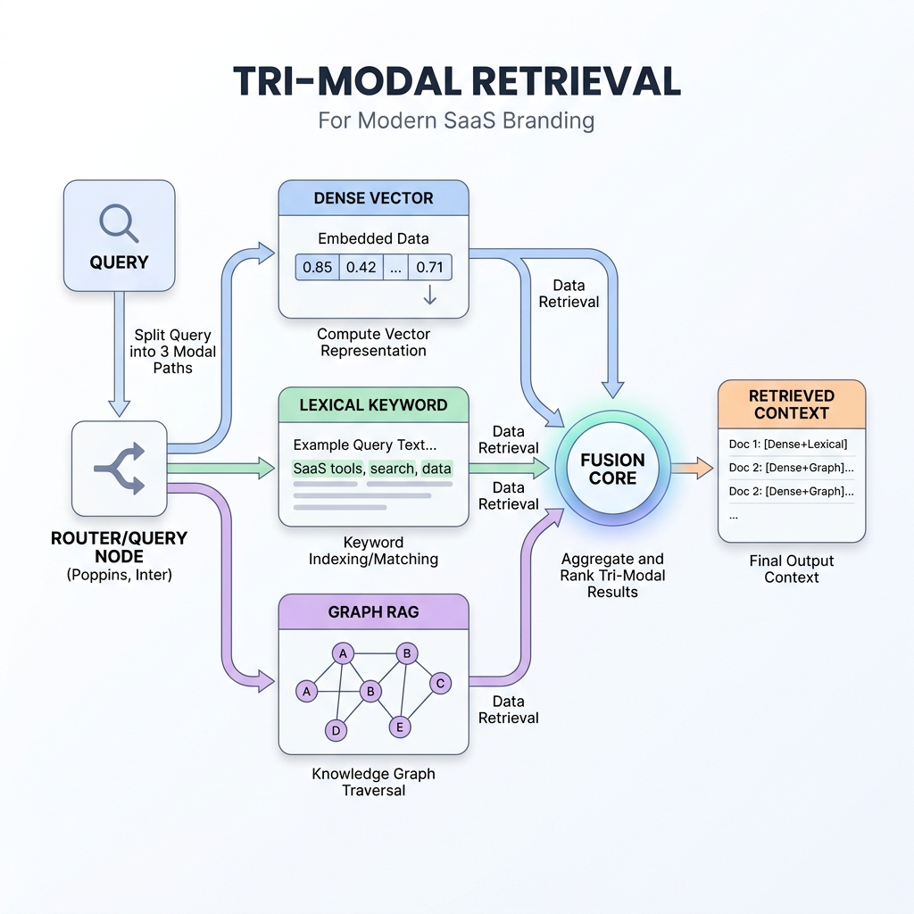
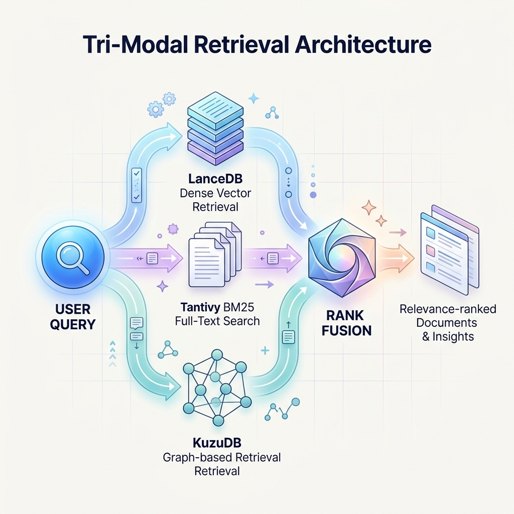

# BIMIndex: Tri-Modal Retrieval Architecture



## The Problem with Traditional RAG
Standard Retrieval-Augmented Generation relies overwhelmingly on dense vector search. After months of intensive research, we proved that vector search alone is fundamentally flawed for enterprise structural data. It suffers from "needle in a haystack" failures when dealing with exact identifiers, and it completely loses the multi-hop relationships inherent in complex documents.

## The Breakthrough: Tri-Modal Retrieval
**BIMIndex** solves this by breaking the reliance on single-mode embeddings. We developed a highly-tuned, concurrent **Tri-Modal Retrieval** mechanism that guarantees maximum recall and contextual depth.



1. **Dense Vector Pathway**: Optimized for deep semantic similarity and abstract conceptual mapping (e.g., LanceDB integration with Multi-Vector Routing).
2. **Lexical Keyword Pathway**: A deterministic inverted index mechanism (BM25/SPLADE) that ensures exact matches (e.g., product codes, strict terms) are never lost (e.g., Tantivy integration).
3. **Graph Relational Pathway**: Captures and preserves the hierarchical structure and multi-hop entity relationships from the original documents (e.g., KùzuDB with Personalized PageRank).

## Reciprocal Rank Fusion Core
The true magic of our proprietary stack happens in the fusion core. The `retrieval_agent.py` orchestrates simultaneous searches across all three pathways and intelligently aggregates the results using **Reciprocal Rank Fusion (RRF)**. This model-agnostic approach ensures that the final retrieved context is structurally sound, semantically relevant, and precisely accurate—no matter what local embedding model is utilized underneath.

## Setup & Execution

```bash
# 1. Install Dependencies
pip install google-antigravity lancedb kuzu tantivy
pip install -r requirements.txt

# 2. Execute the Tri-Modal Search
python retrieval_agent.py
```

## Advanced Evaluation Harness
BIMIndex is not just a runtime environment; it is a laboratory. The repository houses a robust evaluation suite (`retrieval_research`) designed to continuously stress-test extraction algorithms against synthetic and real-world noisy OCR datasets, ensuring our retrieval accuracy remains state-of-the-art.
